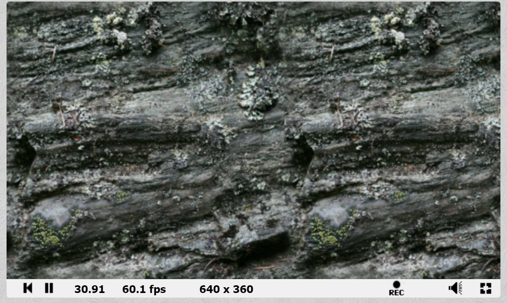
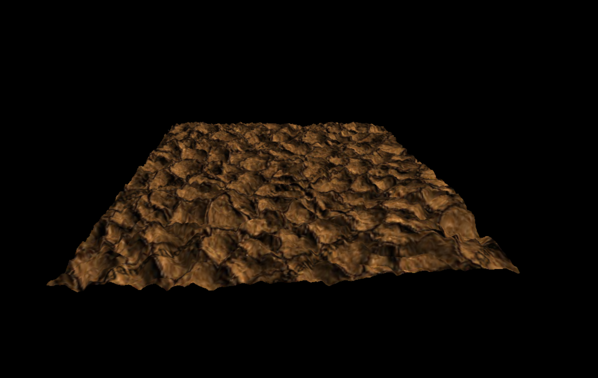
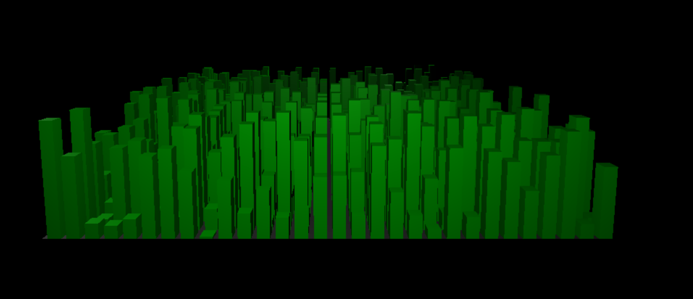

# CMPM163Labs
LAB 2:
Link to Video: https://drive.google.com/file/d/1J0OiBhFwIo1q3iJwTpQnZKO1RPxS_62S/view?usp=sharing

# LAB 3

Link to Video: https://drive.google.com/file/d/1nOEFgTgvXKrBQCMNNpl4-ztxYTtIvh2T/view?usp=sharing 

Bottom Left Cube: Was the cube set to create in the tutorial, uses the MeshPhongMaterial function 2 color values for viewing and a number to set how shiny the cube will be.

Upper Left Cube: Is a cube I was to create on my own using the three.js library. This function is the MeshToonMaterial function which with 2 color values for viewing and a number to set how shiny it is. This creates a more matte colored cube to look like something out of a 3D cartoon.

Bottom Right Cube: This cube creates it's own shader using a vertex shader file as well as a fragment shader. With the fragment shader the "mix" allows two colors to be fused together to give the interpolated effect.

Upper Right Cube: This cube is incomplete. I did not understand the concept of making my own shader in the given handout enough to make a more unique cube. I attempted to follow a youtube video to make something more special except failed as seen in my code. The line commented out in line 181 is what kept breaking my program. I spent hours on hours trying to fix it, I believe the issue in the vshader1 value that I could not access for some reason in my addAnotherCube function. Although still could not find the absolute solution. If it is possible to go into making your own shader a little more that would be very helpful, I could not figure it out on my own based on copying and pasting old code. 

# LAB 4

Link to video: https://drive.google.com/file/d/1dyx204fYg_2OAN_MhidZSpCYdi22lSav/view?usp=sharing

Bottom left cube: This cube just has a single texture formed from the loadtexture method with a jpg as an argument. The texture is the applied through the MeshPhongMaterial function giving the variable to the map variable.

Bottom middle cube: This cube has the same steps applied through the bottom left cube except with added variables. I call an extra loadtexture method to load a normal map jpg to a normMap variable. This is then used to initialize the map variable when I call the MeshPhongMaterial for the new cube.

Bottom right cube: This is the same as the bottom left and middle cubes just using a different texture image as well as a different normal map image. All other steps applied are the same.

Top right cube: This cube creates it's own texture/shader using a vertex shader file as well as a fragment shader. With the fragment shader the texture2D function allows a texture to be added to it through the uniforms variable where we apply the jpg we want after setting the type to "t."

Top left cube: This cube creates it's own texture/shader as well, although the vertex and fragment shaders are created within the html file in their own script tags. The major change is through the fragment shader. Vec2 and uv coordinates are applied through powers of 2. Creating a vec4 variable for the entire face of the cube gets initialized through texture2D() where the vUv (vec2) is multiplied by 2 in order to make the texture smaller. Using THREE.js we use the texture with the wrapS for horizontal portions of the cube and wrapT for vertical portions, then repeating it for all areas of the cube. 

# LAB 5

Link to Video: https://drive.google.com/file/d/1ZXYipsxq9LRm0UVY66PTuAlajc9PD2jt/view?usp=sharing

This was an attempt to see if my laptop could handle Unity. The answer was barely. If you can tell when I click run it takes a second to play the game. I spent a long time trying to save again and again, but my laptop would freeze at the end every time. I apologize, I hope the video will suffice. 

I managed to get the particles down, I did a little less of a glow and made the color through the asset yellow. With the added modifications all I did was change the color of the kart, set to less gravity when you go off a jump, as well as the ramp which was a given asset to in the karts asset folder. I understand my modifications aren't much, I did what I could handle through my laptop.

# LAB 6

Link to my project: https://www.shadertoy.com/view/tssBzl

Link to a cool project: https://www.shadertoy.com/view/4ttSWf

# LAB 7

Link to water video: https://drive.google.com/file/d/1ef957Sme_pCuvnxzFKqqeaeuGLoZlu27/view?usp=sharing

# LAB 8

Partner: Mia Kennedy

i. She did part 2
ii. she said the tutorial was not too hard, but while trying to make the city she wanted to figure out how make her street purposely random in size (having wider and slimmer streets), she said that it took a little while.
iii. She though the most interesting part of the tutorial was using the perlin noise texture to make the randomness of the buildings look so intentional. 
